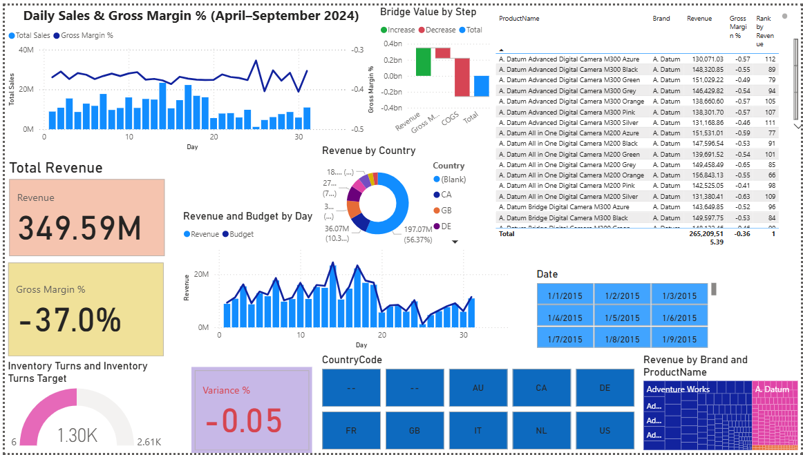
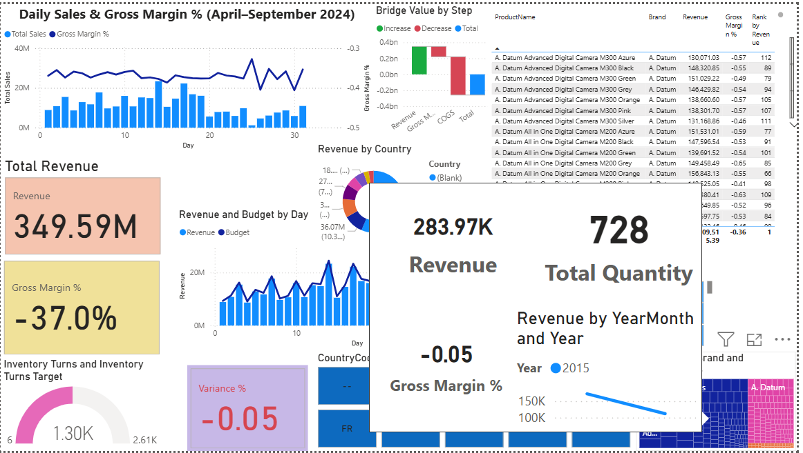
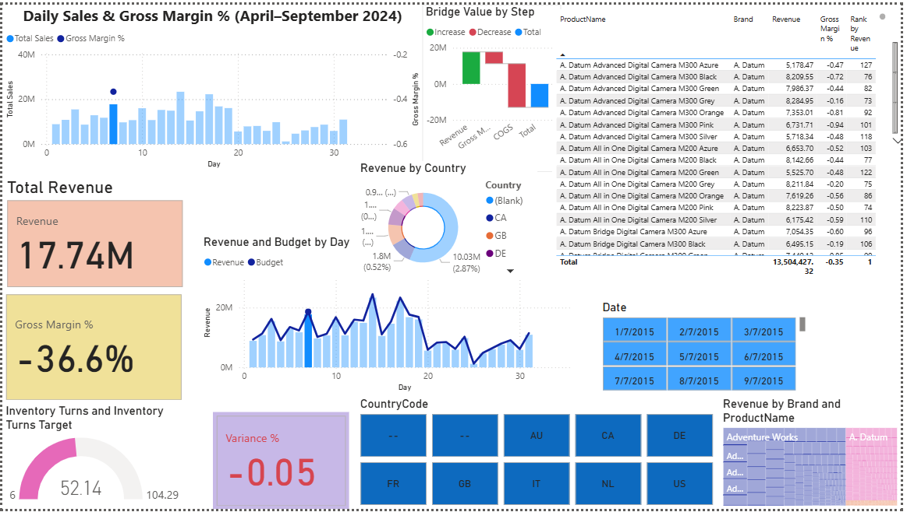

# Retail Ops 360 — FP&A Dashboard (Power BI + SQL + DAX)

A recruiter-ready FP&A dashboard built on a **Contoso dataset (~1M rows)**.  
Covers core financial analytics: Revenue, Margin, Budget Variance, Inventory Turns, and Customer Insights.  

---

## 📊 Key Features
- **Executive Overview**: KPIs (Revenue, GM%, Variance %, Inventory Turns, Customers) + Revenue vs Budget trend.  
- **Sales Trend**: Daily sales & GM% line/column combo.  
- **Product Mix**: Treemap with custom tooltip, Margin Bridge waterfall, Top 10 Products table.  
- **Customer & Geo**: Revenue by Age/Gender, Customer Count, Revenue by Country (map).  
- **Inventory & Ops**: Inventory Turns gauge + trend line.  

---

## 🛠️ Tech Stack
- **SQL Server + SSMS**: Staging + star schema (FactSales, DimDate, DimProduct, DimCustomer, DimStore).  
- **Power BI**: Data model, DAX measures, visuals, KPIs.  
- **DAX**: Revenue, COGS, GM%, Variance %, Inventory Turns, Dynamic Titles.  

---

## 📸 Screenshots
- Executive Overview  
    
- Sales Trend  
    
- Product Mix  
    

---

## 📂 Repo Structure
